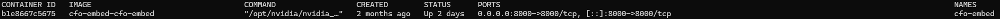
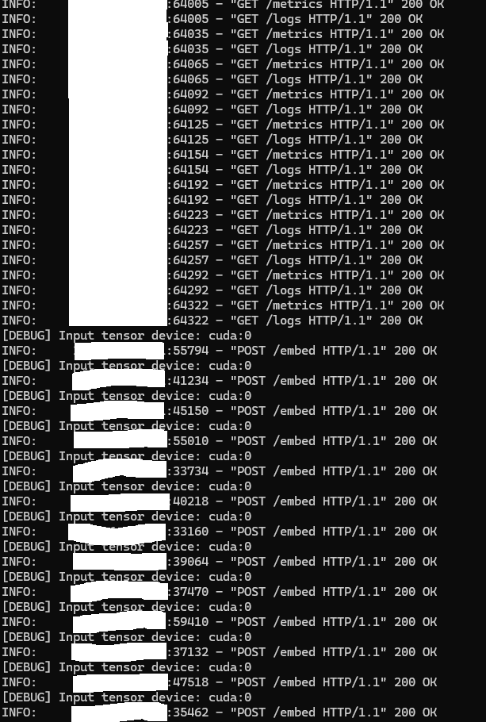

  # 🔡 CFO Embed (Demo)

  A **public-safe demo** of the embedding service. In the full system, this service runs GPU-backed
  embedding models. This demo returns **deterministic pseudo-embeddings** without loading any models.

  ---

  ## 🔹 Quick Start

  ### Run with Docker
  ```bash
  docker build -t cfo-embed-demo .
  docker run --rm -p 8005:8005 cfo-embed-demo
  ```

  ### Or run locally (no Docker)
  ```bash
  python -m venv .venv && source .venv/bin/activate
  pip install -r requirements.txt
  uvicorn src.main:app --host 0.0.0.0 --port 8005
  ```

  ### Test
  ```bash
  curl -s -X POST http://localhost:8005/api/embed \
-H "Content-Type: application/json" \
-d '{"texts":["hello","world"]}'
  ```

  ---

  ## 🔹 API

  - `GET /api/healthz` -> `{"status":"ok"}`
  - `POST /api/embed` -> `{"vectors":[...], "dim":8, "meta": {...}}`

  ---

  ## 🔹 Sequence

  ```mermaid
  sequenceDiagram
    participant R as "CFO Router (Demo)"
    participant E as "CFO Embed (Demo)"
    R->>E: POST /api/embed {"texts": ["hello","world"]}
    E-->>R: 200 {"vectors": [[...],[...]], "dim": 8}
  ```

  **Explanation:** Router calls Embed to generate embeddings. Demo returns deterministic pseudo-vectors.

  ---

  ## 🔹 Demo Screenshots

  - **Docker container running**  
    

  - **Embed call**  
    

  ---

  ## 🔹 Disclaimer
  See [DISCLAIMER.md](./DISCLAIMER.md). This is a demo-only repository.
  Full production implementations remain private.

  ## 🔹 Security
  See [SECURITY.md](./SECURITY.md). Do not expose demo services to the internet.

  ## 🔹 License
  All Rights Reserved. See [LICENSE.md](./LICENSE.md).
